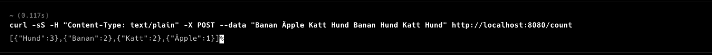

# Welcome to text analysis application
### This is a Java application that analyzes a text mass and returns the top 10 most frequent words and their frequencies.

<picture>
 <source media="(prefers-color-scheme: light)" srcset="YOUR-LIGHTMODE-IMAGE">
 
</picture>

## Prerequisites
* ## To build and run this application, you will need:
*  Java 8 or higher
*  Maven 2.7.9 or higher

## Building the Application
#### To build the application, follow these steps:

1. Clone the repository to your local machine.
2. Open a terminal and navigate to the root directory of the project.
3. Run the following command to build the application:
* $> mvn clean package
4. This will create a target directory containing a textmassa-1.0.jar file.

## Running the Application
#### To run the application, follow these steps:
1. Open a terminal and navigate to the target directory.
2. Run the following command to start the application:
* $> java -jar textmassa-1.0.jar
3. This will start the application on port 8080.

## Using the API
#### To use the API, you can send a POST request to the /count endpoint with a text mass in the request body. Here's an example using curl:
* $> curl -H "Content-Type: text/plain" -X POST -d "Banan Äpple Katt Hund Banan Hund Katt Hund" http://localhost:8080/count
- The command includes
- the header "-H 'Content-Type: text/plain'" which specifies that the data being sent is in plain text format.
- The header "-X POST" specifies that this is a POST request.
-  The option "-d" specifies the data to be sent in the request body.
#### This will return a JSON object with the top 10 most frequent words and their frequencies:

<picture>
 <source media="(prefers-color-scheme: light)" srcset="YOUR-LIGHTMODE-IMAGE">
 
</picture>
